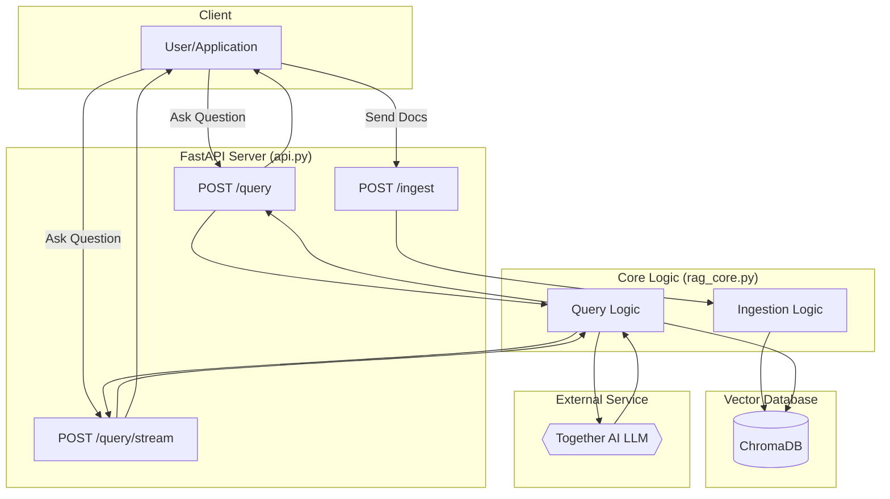

# API-Driven RAG System with FastAPI and Together AI

[](https://www.python.org/downloads/)
[](https://fastapi.tiangolo.com/)
[](https://www.trychroma.com/)

### **Project Overview**

This repository contains a complete, API-driven Retrieval-Augmented Generation (RAG) system. It is designed to answer questions from a knowledge base of documents, featuring a dynamic ingestion endpoint and a high-performance query API powered by FastAPI.

The system uses local sentence-transformer models for creating embeddings, **ChromaDB** as a persistent vector database, and makes direct API calls to **Together AI** for state-of-the-art language generation. This project serves as a comprehensive blueprint for building and deploying a modern, scalable RAG service.

---

### **System Architecture**

The project is architected around a central core logic module (`rag_core.py`) and a FastAPI server (`api.py`), providing a clear separation between the RAG pipeline and the web interface.

**1. RAG Core (`rag_core.py`)**
This module contains all the business logic for the RAG pipeline:
-   **Text Chunking:** Splits text into semantic chunks using a sentence-windowing strategy.
-   **Embedding:** Generates vector embeddings locally using `sentence-transformers`.
-   **Vector Storage:** Manages a persistent **ChromaDB** collection for storing and querying document chunks.
-   **Retrieval:** Performs hybrid retrieval with metadata filtering and semantic vector search.
-   **Generation:** Constructs prompts and calls the Together AI API for final answer generation.

**2. API Server (`api.py`)**
This FastAPI application exposes the RAG core logic through a clean, self-documenting REST API.


---

### **Key Features**

-   **Dynamic Ingestion API (`/ingest`):** Upload new documents and texts to the knowledge base on-the-fly without restarting the server.
-   **Powerful Query API (`/query`):** Ask questions and receive rich JSON responses containing the answer, context chunks, and similarity scores.
-   **Real-time Streaming (`/query/stream`):** Get answers token-by-token for a highly responsive user experience.
-   **Metadata Filtering:** Narrow down searches by source document or other metadata for more precise results.
-   **Production-Ready Database:** Uses **ChromaDB** for persistent, scalable vector storage and retrieval.
-   **Decoupled & Reusable:** Core logic is separated in `rag_core.py`, making it easy to maintain and test.
-   **Self-Documenting:** FastAPI automatically generates interactive API documentation (Swagger UI).

---

### **Project Structure**
```
.
├── .env                  # Your secret API keys (ignored by git)
├── .env.example          # Template for environment variables
├── api.py                # The FastAPI server with /ingest and /query endpoints
├── rag_core.py           # All core RAG pipeline logic (chunking, embedding, retrieval, generation)
├── ingestion_cli.py      # CLI tool for bulk-ingesting local PDFs
├── chat_cli.py           # CLI tool for interacting with the RAG system via the terminal
├── upload_pdf_to_api.py  # Client script example for uploading a PDF to the live API
├── requirements.txt      # Project dependencies
└── data/                 # Folder for your source PDF documents
```

---

## **Setup Guide**

### **1. Prerequisites**

-   [Git](https://git-scm.com/)
-   [Python 3.9+](https://www.python.org/downloads/)
-   A [Together AI](https://api.together.xyz/) API Key

### **2. Installation**

First, clone the repository and set up your Python virtual environment.

```bash
# Clone the repository
git clone https://github.com/your-username/your-repo-name.git
cd your-repo-name

# Create and activate the virtual environment
python -m venv venv
# On macOS/Linux:
source venv/bin/activate
# On Windows:
.\venv\Scripts\activate

# Install all required dependencies
pip install -r requirements.txt
```

### **3. Environment Setup**

Create a `.env` file and add your Together AI API key.

```bash
# Create the .env file from the example
cp .env.example .env

# Now, open the .env file and add your key:
# TOGETHER_API_KEY="your_together_ai_api_key_here"
```

---

## **How to Use**

The system is designed to be run as an API server. You can populate it with data using either the CLI or a client script.

### **Stage 1: Populate the Vector Database (Choose one method)**

#### **Method A: Bulk Ingestion via CLI (Recommended for first-time setup)**
This script will process all PDFs in the `data/` directory.

```bash
# Before running, delete any old vector store to start fresh
# rm -rf vector_store

# Run the command-line ingestion tool
python ingestion_cli.py
```
This will create a `vector_store/` directory containing the ChromaDB database.

#### **Method B: Dynamic Ingestion via API**
First, start the API server (see Stage 2), then use a client script to upload files. This is useful for adding new documents without stopping the server.

```bash
# In a new terminal, run the upload script
python upload_pdf_to_api.py
```

### **Stage 2: Run the API Server**

Start the FastAPI server. This makes your RAG system available as a service.

```bash
uvicorn api:app --reload
```
The API is now live at `http://127.0.0.1:8000`.

### **Stage 3: Interact with the System**

You have two primary ways to interact with the running API:

#### **A) API Documentation (Recommended for testing)**

Open your browser and navigate to the auto-generated Swagger UI documentation:
**[http://127.0.0.1:8000/docs](http://127.0.0.1:8000/docs)**

From here, you can test the `/ingest` and `/query` endpoints interactively.

<details>
<summary><strong>Click to see an example API request for /query</strong></summary>

Send a `POST` request to `http://127.0.0.1:8000/query` with the following JSON body:

```json
{
  "query": "What is multi-head attention?",
  "top_k": 3,
  "source_filter": "attention.pdf"
}
```
</details>

#### **B) Command-Line Chat (For quick checks)**

You can also use the `chat_cli.py` script to interact with your RAG system through the terminal. This script calls the same core logic that the API uses.

```bash
python chat_cli.py
```

---

## **Next Steps & Future Enhancements**

-   **Build a Frontend:** Create a web interface with Streamlit or React that communicates with this FastAPI backend.
-   **Implement Chat History:** Extend the `/query` endpoint to accept and manage conversation history for follow-up questions.
-   **Add Re-ranking:** Integrate a Cross-Encoder model in `rag_core.py` for more precise context retrieval.
-   **Containerize & Deploy:** Package the application with Docker and deploy it to a cloud service.
